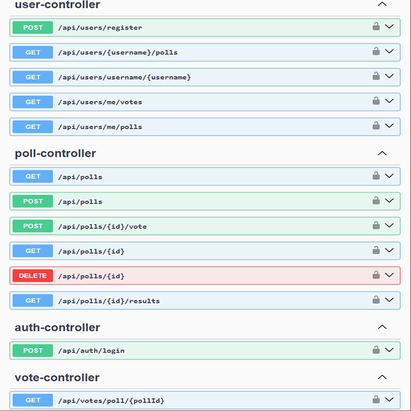
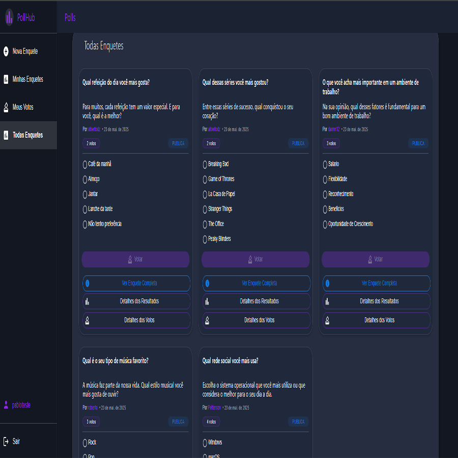
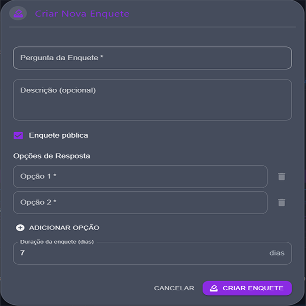
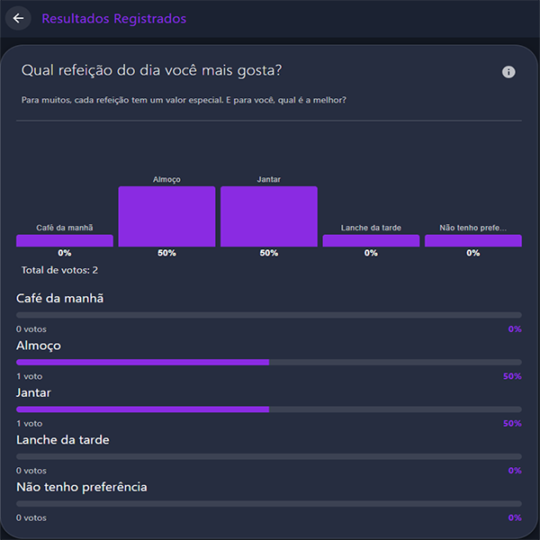
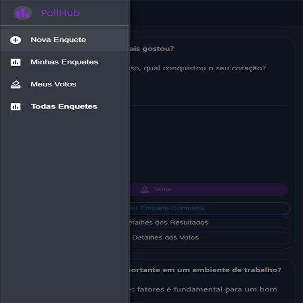

<div align="center">
 

# PollHub

<em>Plataforma completa para criação, gerenciamento e participação em enquetes com autenticação segura e interface responsiva inspirada no template oficial do Material UI.</em>

<!-- BADGES -->
<p>


</p>

</div>

## 📋 Índice

- [Visão Geral](#visao-geral)
- [Arquitetura](#arquitetura)
- [Stack Tecnológica](#stack-tecnologica)
- [Estrutura do Projeto](#estrutura-do-projeto)
- [Configuração e Execução](#configuracao-e-execucao)
- [Variáveis de Ambiente](#variaveis-de-ambiente)
- [API Endpoints](#api-endpoints)
- [Papéis e Permissões](#papeis-e-permissoes)
- [Deploy e CI/CD](#deploy-e-cicd)
- [Testes](#testes)
- [Swagger](#api-documentation-swagger)
- [Demonstração](#demonstracao)
- [Screenshots do Sistema](#screenshots-do-sistema)
- [Contribuição](#contribuicao)
- [Licença](#licenca)
- [Contato](#contato)

## 🔍 Visão Geral

O **PollHub** é uma plataforma completa para criação, gerenciamento e participação em enquetes online. Desenvolvido com tecnologias modernas, oferece uma experiência fluida tanto para criadores quanto para participantes de enquetes.

### Principais Funcionalidades

- **Autenticação Segura**: Sistema completo de login/registro com JWT
- **Criação de Enquetes**: Interface intuitiva para criar enquetes com múltiplas opções
- **Votação em Tempo Real**: Participação em enquetes com feedback instantâneo
- **Resultados Dinâmicos**: Visualização de resultados em tempo real com gráficos
- **Compartilhamento de Enquetes**: Sistema para compartilhar enquetes próprias
- **Perfil de Usuário**: Gerenciamento de dados pessoais e histórico de participação
- **Controle Administrativo**: Sistema de permissões para administradores
- **Interface Responsiva**: Design moderno e adaptável a diferentes dispositivos baseado no template oficial do Material UI
- **API RESTful**: Backend robusto com documentação completa via Swagger (apenas em ambiente local)

### Interface Baseada no Material UI

O frontend foi desenvolvido utilizando como base o template oficial do Material UI para autenticação:
- **Template Base**: [Material UI Sign-Up Template](https://mui.com/material-ui/getting-started/templates/sign-up/)
- **Design System**: Material Design 3
- **Componentes**: Material UI v5+

## 🏗️ Arquitetura

O projeto segue uma arquitetura de **Single Page Application (SPA)** com backend RESTful:

### Frontend (React + Vite)
- **React 18+**: Biblioteca para construção da interface
- **Vite**: Build tool de alta performance
- **Material-UI**: Framework de design moderno
- **Context API**: Gerenciamento de estado global
- **React Router**: Navegação entre páginas

### Backend (Spring Boot)
- **Spring Boot 3.x**: Framework para desenvolvimento enterprise
- **Spring Security + JWT**: Autenticação e autorização
- **Spring Data JPA**: Persistência de dados
- **PostgreSQL em Nuvem**: Banco de dados relacional fornecido pelo Render
- **Swagger/OpenAPI**: Documentação automática da API (apenas local)

### Deploy e Infraestrutura
- **Frontend**: Hospedado no Vercel com CI/CD automático
- **Backend**: Hospedado no Render com deploy contínuo
- **Banco de Dados**: PostgreSQL em nuvem fornecido pelo Render
- **CI/CD**: GitHub Actions para automação

## 🛠️ Stack Tecnológica

### Frontend
- **React 18+**: Biblioteca JavaScript para interfaces
- **Vite**: Build tool e dev server otimizado
- **Material-UI (MUI)**: Framework de componentes React
- **React Router v6+**: Roteamento de páginas
- **Axios**: Cliente HTTP para APIs
- **Context API**: Gerenciamento de estado
- **ESLint**: Linting e padronização de código

### Backend
- **Java 21**: Linguagem de programação
- **Spring Boot 3.x**: Framework de desenvolvimento
- **Spring Security**: Segurança e autenticação
- **Spring Data JPA**: Acesso a dados
- **JWT**: Tokens de autenticação
- **PostgreSQL**: Sistema de banco de dados em nuvem (Render)
- **Swagger/OpenAPI 3**: Documentação da API (apenas local)
- **Maven**: Gerenciamento de dependências

### Ferramentas
- **JUnit 5**: Testes unitários
- **Mockito**: Mocks para testes
- **GitHub Actions**: CI/CD
- **Docker**: Containerização (opcional)

## 📁 Estrutura do Projeto

<details>
<summary><strong>🗂️ Ver estrutura do Frontend</strong></summary>

```
pollhub-frontend/
├── public/                           # Arquivos estáticos
├── src/
│   ├── api/                         # Configuração da API
│   │   └── client.js                # Cliente HTTP configurado
│   ├── assets/                      # Recursos estáticos
│   ├── components/                  # Componentes reutilizáveis
│   │   ├── PollCard.jsx             # Card de enquete
│   │   ├── PollCreationDialog.jsx   # Modal de criação de enquetes
│   │   └── ProtectedRoute.jsx       # Proteção de rotas
│   ├── contexts/                    # Contextos React
│   │   └── AuthContext.jsx          # Contexto de autenticação
│   ├── pages/                       # Páginas da aplicação
│   │   ├── AllPolls.jsx             # Lista de todas as enquetes
│   │   ├── Dashboard.jsx            # Dashboard principal
│   │   ├── Login.jsx                # Página de login
│   │   ├── PollResults.jsx          # Resultados de enquetes
│   │   ├── PollVotes.jsx            # Votos de uma enquete
│   │   ├── Register.jsx             # Cadastro de usuários
│   │   ├── UserProfile.jsx          # Perfil do usuário
│   │   └── UserVotes.jsx            # Histórico de votos
│   ├── theme/                       # Configuração do tema MUI
│   ├── App.css                      # Estilos globais
│   ├── AppRoutes.jsx                # Configuração de rotas
│   ├── index.css                    # Reset CSS
│   └── main.jsx                     # Ponto de entrada
├── .env                             # Variáveis de ambiente
├── package.json                     # Dependências e scripts
├── vercel.json                      # Configuração do Vercel
└── vite.config.js                   # Configuração do Vite
```

</details>

<details>
<summary><strong>🗂️ Ver estrutura do Backend</strong></summary>

```
pollhub/
├── .github/workflows/               # CI/CD GitHub Actions
│   └── ci.yml                       # Pipeline de integração
├── src/main/java/com/pablorodriguesb/pollhub/
│   ├── config/                      # Configurações
│   │   ├── OpenApiConfig.java       # Configuração do Swagger
│   │   └── SecurityConfig.java      # Configuração de segurança
│   ├── controller/                  # Controllers REST
│   │   ├── AdminPollController.java # Endpoints administrativos
│   │   ├── AuthController.java      # Autenticação
│   │   ├── PollController.java      # Enquetes
│   │   ├── UserController.java      # Usuários
│   │   └── VoteController.java      # Votação
│   ├── dto/                         # Data Transfer Objects
│   │   ├── OptionDTO.java           # DTO de opções
│   │   ├── PollDTO.java             # DTO de enquetes
│   │   ├── UserDTO.java             # DTO de usuários
│   │   └── VoteDTO.java             # DTO de votos
│   ├── exception/                   # Tratamento de exceções
│   │   ├── GlobalExceptionHandler.java
│   │   └── ResourceNotFoundException.java
│   ├── model/                       # Entidades JPA
│   │   ├── Option.java              # Opção de enquete
│   │   ├── Poll.java                # Enquete
│   │   ├── User.java                # Usuário
│   │   └── Vote.java                # Voto
│   ├── repository/                  # Repositórios JPA
│   │   ├── OptionRepository.java
│   │   ├── PollRepository.java
│   │   ├── UserRepository.java
│   │   └── VoteRepository.java
│   ├── security/                    # Segurança JWT
│   │   ├── JwtAuthenticationEntryPoint.java
│   │   ├── JwtRequestFilter.java
│   │   └── JwtTokenUtil.java
│   ├── service/                     # Camada de serviços
│   │   ├── CustomUserDetailsService.java
│   │   ├── PollService.java
│   │   ├── UserService.java
│   │   └── VoteService.java
│   └── PollHubApplication.java      # Classe principal
├── src/main/resources/
│   └── application.properties       # Configurações (não versionado)
├── src/test/                        # Testes automatizados
├── Dockerfile                       # Container Docker
├── pom.xml                          # Dependências Maven
└── README.md                        # Documentação
```

</details>

## ⚙️ Configuração e Execução

### Pré-requisitos
- **Java 21**
- **Maven 3.8+**
- **Node.js 16+**
- **PostgreSQL 13+** (local ou em nuvem)
- **Git**

### Configuração do Backend

#### 1. Clone o Repositório
```bash
git clone https://github.com/pablorodriguesb/pollhub.git
cd pollhub
```

#### 2. Configure o Banco de Dados
Para desenvolvimento local, crie um banco PostgreSQL:
```sql
CREATE DATABASE pollhub;
```

> **💡 Nota**: Em produção, o sistema utiliza PostgreSQL em nuvem fornecido pelo Render.

#### 3. Configure as Variáveis de Ambiente
O arquivo `application.properties` está oculto por questões de segurança. Todas as configurações são feitas via variáveis de ambiente.

Configure as seguintes variáveis de acordo com seu sistema operacional:

```bash
# Exemplos de configuração (sintaxe varia por SO)
DB_URL=jdbc:postgresql://localhost:5432/pollhub
DB_USERNAME=seu_usuario
DB_PASSWORD=sua_senha
JWT_SECRET=sua_chave_secreta_jwt_muito_longa_e_segura
JWT_EXPIRATION=86400000
```

#### 4. Execute o Backend
```bash
# Compilar e executar
mvn clean spring-boot:run

# Ou compilar e executar o JAR
mvn clean package
java -jar target/pollhub-0.0.1-SNAPSHOT.jar
```

O backend estará disponível em `http://localhost:8080`

### Configuração do Frontend

#### 1. Navegue para o Diretório Frontend
```bash
cd pollhub-frontend
```

#### 2. Instale as Dependências
```bash
npm install
```

#### 3. Configure o Arquivo .env
Crie o arquivo `.env` na raiz do frontend:
```env
VITE_API_BASE_URL=http://localhost:8080/api
```

#### 4. Execute o Frontend
```bash
# Modo desenvolvimento
npm run dev

# Build para produção
npm run build

# Preview do build
npm run preview
```

O frontend estará disponível em `http://localhost:5173`

## 🔧 Variáveis de Ambiente

### Backend
Todas as configurações sensíveis são gerenciadas via variáveis de ambiente:

| Variável | Descrição | Exemplo |
|----------|-----------|---------|
| `DB_URL` | URL de conexão com PostgreSQL | `jdbc:postgresql://localhost:5432/pollhub` |
| `DB_USERNAME` | Usuário do banco de dados | `postgres` |
| `DB_PASSWORD` | Senha do banco de dados | `minhasenha123` |
| `JWT_SECRET` | Chave secreta para JWT (mín. 256 bits) | `minha_chave_super_secreta_jwt_256_bits` |
| `JWT_EXPIRATION` | Tempo de expiração do token JWT em milissegundos (padrão: 86400000, ou seja, 24 horas) | `86400000` |

### Frontend
| Variável | Descrição | Exemplo |
|----------|-----------|---------|
| `VITE_API_BASE_URL` | URL base da API backend | `http://localhost:8080/api` |

## 🚀 API Endpoints

### Autenticação
```http
POST   /api/auth/login              # Fazer login
POST   /api/users/register          # Registrar usuário
```

### Usuários
```http
GET    /api/users/username/{username}    # Buscar usuário por username
GET    /api/users/{username}/polls       # Listar enquetes de um usuário
GET    /api/users/me/votes               # Listar votos do usuário atual
GET    /api/users/me/polls               # Listar enquetes do usuário atual
```

### Enquetes
```http
GET    /api/polls                   # Listar todas as enquetes
POST   /api/polls                   # Criar nova enquete
GET    /api/polls/{id}              # Obter enquete específica
DELETE /api/polls/{id}              # Deletar enquete (apenas criador/admin)
GET    /api/polls/{id}/results      # Obter resultados da enquete
```

### Votação
```http
POST   /api/polls/{id}/vote         # Votar em uma enquete
GET    /api/votes/poll/{pollId}     # Obter votos de uma enquete
```

### Administração
```http
DELETE /admin/polls/{id}            # Deletar qualquer enquete (apenas admins)
```

### Exemplos de Request/Response

#### Criar Enquete
**Request:**
```http
POST /api/polls
Authorization: Bearer <jwt-token>
Content-Type: application/json

{
  "question": "Qual sua linguagem de programação favorita?",
  "options": [
    {"text": "Java"},
    {"text": "JavaScript"},
    {"text": "Python"},
    {"text": "C#"}
  ]
}
```

**Response:**
```json
{
  "id": 1,
  "question": "Qual sua linguagem de programação favorita?",
  "options": [
    {"id": 1, "text": "Java", "voteCount": 0},
    {"id": 2, "text": "JavaScript", "voteCount": 0},
    {"id": 3, "text": "Python", "voteCount": 0},
    {"id": 4, "text": "C#", "voteCount": 0}
  ],
  "createdBy": "usuario123",
  "createdAt": "2024-01-15T10:30:00Z",
  "totalVotes": 0
}
```

#### Votar
**Request:**
```http
POST /api/polls/1/vote
Authorization: Bearer <jwt-token>
Content-Type: application/json

{
  "optionId": 2
}
```

**Response:**
```json
{
  "id": 1,
  "pollId": 1,
  "optionId": 2,
  "votedBy": "usuario123",
  "votedAt": "2024-01-15T10:35:00Z"
}
```

## 👥 Papéis e Permissões

O sistema implementa dois níveis de acesso baseados em permissões:

### ROLE_USER (Usuário Padrão)
- ✅ Criar enquetes
- ✅ Votar em enquetes (uma vez por enquete)
- ✅ Visualizar resultados
- ✅ Gerenciar, deletar e compartilhar as próprias enquetes
- ✅ Visualizar histórico de votos
- ❌ Deletar enquetes de outros usuários

### ROLE_ADMIN (Administrador)
- ✅ Todas as permissões de usuário
- ✅ Deletar qualquer enquete
- ✅ Visualizar estatísticas globais
- ✅ Gerenciar usuários (futuro)

> **📝 Nota**: O controle administrativo é realizado através de permissões no backend. Não existe interface gráfica específica para administração, apenas endpoints protegidos por roles.

## 🚀 Deploy e CI/CD

### Arquitetura de Deploy

- **Frontend**: Hospedado no **Vercel**
- **Backend**: Hospedado no **Render**
- **Banco de Dados**: PostgreSQL em nuvem fornecido pelo Render
- **CI/CD**: GitHub Actions

### Deploy Automático

#### Backend (Render)
1. Conecte seu repositório ao Render
2. Configure as variáveis de ambiente:
   ```
   DB_URL=sua_url_postgresql_render
   DB_USERNAME=seu_usuario
   DB_PASSWORD=sua_senha
   JWT_SECRET=sua_chave_jwt_producao
   JWT_EXPIRATION=86400000
   ```
3. O deploy acontece automaticamente a cada push na branch `main`

#### Frontend (Vercel)
1. Conecte seu repositório ao Vercel
2. Configure a variável de ambiente:
   ```
   VITE_API_BASE_URL=https://sua-api.render.com/api
   ```
3. O deploy acontece automaticamente a cada push

#### CI/CD com GitHub Actions
O arquivo `.github/workflows/ci.yml` automatiza:
- Execução de testes
- Build da aplicação
- Validação da qualidade do código
- Deploy automático em produção

### Configuração de Produção

#### Variáveis de Ambiente - Produção
```bash
# Backend (Render)
DB_URL=jdbc:postgresql://<host-do-banco>:5432/<nome-do-banco>
DB_USERNAME=<usuario_prod>
DB_PASSWORD=<senha_super_segura_prod>
JWT_SECRET=<chave_jwt_muito_longa_e_segura_para_producao_256_bits>
JWT_EXPIRATION=86400000 # 24 horas em milissegundos

# Frontend (Vercel)
VITE_API_BASE_URL=https://pollhub-api.render.com/api
```

## 🧪 Testes

### Backend - Testes com JUnit 5

#### Executar Todos os Testes
```bash
mvn test
```

#### Executar Testes com Coverage
```bash
mvn test jacoco:report
```

#### Tipos de Testes Implementados
- **Testes Unitários dos Serviços**: PollService, UserService, VoteService e CustomUserDetailsService
- **Teste Principal de Aplicação**: PollHubApplicationTests para verificar o contexto da aplicação

#### Exemplos de Testes
```bash
# Testar apenas serviços
mvn test -Dtest="*ServiceTest"

# Testar um serviço específico
mvn test -Dtest="PollServiceTest"

# Executar testes com perfil de teste
mvn test -Dspring.profiles.active=test
```

### Frontend - Testes (TODO)
```bash
# Executar testes unitários
npm run test

# Executar testes com coverage
npm run test:coverage

# Executar testes E2E
npm run test:e2e
```

### API Documentation (Swagger)

**⚠️ Importante**: Por motivos de segurança, a documentação Swagger está disponível **apenas em ambiente local**.

- **Local**: `http://localhost:8080/swagger-ui.html`
- **Produção**: Não disponível (desabilitado por segurança)

Para acessar a documentação completa da API, execute o projeto localmente e acesse o endpoint Swagger mencionado acima.

#### Visualização da Documentação (Swagger)

<p align="center">
  
  
</p>

## 🎨 Demonstração

### Principais Funcionalidades

#### Dashboard Principal
- Visão geral das enquetes
- Estatísticas de participação
- Acesso rápido às funcionalidades

#### Criação de Enquetes
- Interface intuitiva para criar enquetes
- Adição dinâmica de opções
- Validação em tempo real

#### Votação e Resultados
- Interface de votação simples
- Resultados em tempo real com gráficos
- Histórico de participação

#### Compartilhamento
- Sistema para compartilhar enquetes próprias
- URLs amigáveis para compartilhamento
- Controle de privacidade

📸 Screenshots do Sistema
<table>
  <tr>
    <td align="center" width="50%">
      <br>
      <sub><b>Tela Principal - Dashboard</b></sub>
    </td>
    <td align="center" width="50%">
      <br>
      <sub><b>Criação de Enquetes</b></sub>
    </td>
  </tr>
  <tr>
    <td align="center" width="50%">
      <br>
      <sub><b>Visualização de Resultados</b></sub>
    </td>
    <td align="center" width="50%">
      <br>
      <sub><b>Interface Mobile</b></sub>
    </td>
  </tr>
</table>


## 🤝 Contribuição

Contribuições são muito bem-vindas! Para contribuir:

### Como Contribuir
1. **Fork** o projeto
2. Crie uma **branch** para sua feature (`git checkout -b feature/nova-funcionalidade`)
3. **Implemente** suas mudanças seguindo os padrões do projeto
4. **Execute os testes** e garanta que tudo funciona
5. **Commit** suas mudanças (`git commit -m 'feat: Nova funcionalidade'`)
6. **Push** para a branch (`git push origin feature/nova-funcionalidade`)
7. Abra um **Pull Request** detalhando as alterações

### Padrões de Desenvolvimento

#### Commits Convencionais
```
feat: Nova funcionalidade
fix: Correção de bug  
docs: Alteração na documentação
style: Formatação de código
refactor: Refatoração
test: Adição/correção de testes
chore: Tarefas de build, CI/CD
```

### Roadmap
- [X] Criação, votação e gerenciamento de enquetes
- [X] Enquetes com tempo limite
- [X] Autenticação JWT e controle de permissões (ROLE_USER, ROLE_ADMIN)
- [X] Deletar e compartilhar enquetes próprias
- [x] Responsividade para dispositivos móveis
- [ ] Integração com redes sociais
- [ ] Painel administrativo visual

## 📄 Licença

Este projeto está sob a licença **MIT**. Veja o arquivo [LICENSE](LICENSE) para mais detalhes.

## 📞 Contato

**Pablo Rodrigues**
- GitHub: [@pablorodriguesb](https://github.com/pablorodriguesb)
- LinkedIn: [Pablo Rodrigues](https://linkedin.com/in/pablorodriguesb)
- Email: pablorodrigues.bat@gmail.com

---

<div align="center">
<p>⭐ Se este projeto te agradou, deixe uma estrela! </p>
</div>